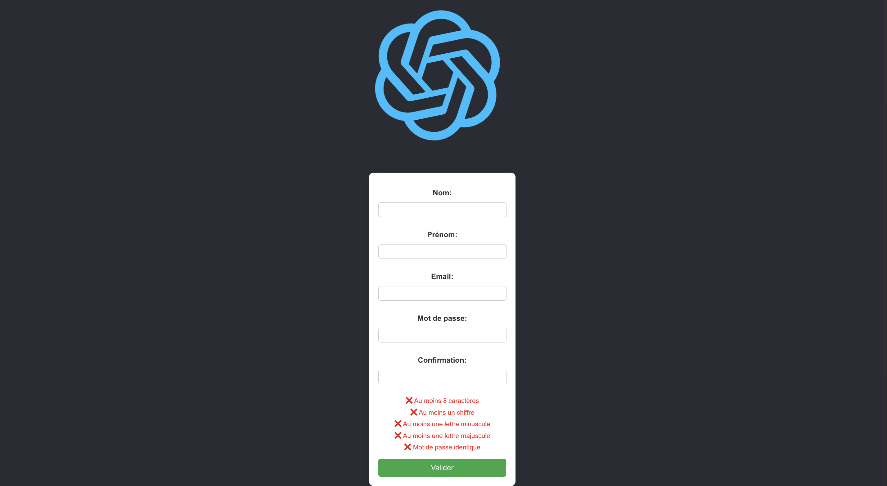

# Formulaire Application

This is a Node.js application for handling form submissions.



## Features

- User-friendly form interface
- Data validation
- Submission handling
- Error notifications

## Installation

1. Clone the repository:
    ```sh
    git clone https://github.com/yourusername/formulaire.git
    ```
2. Navigate to the project directory:
    ```sh
    cd formulaire
    ```
3. Install dependencies:
    ```sh
    npm install
    ```

## Usage

1. Start the application:
    ```sh
    npm start
    ```
2. Open your browser and navigate to `http://localhost:3000`.

## Contributing

1. Fork the repository.
2. Create a new branch:
    ```sh
    git checkout -b feature-branch
    ```
3. Make your changes and commit them:
    ```sh
    git commit -m "Description of changes"
    ```
4. Push to the branch:
    ```sh
    git push origin feature-branch
    ```
5. Create a pull request.

## License

This project is licensed under the MIT License.

## Contact

For any inquiries, please contact [your-email@example.com].